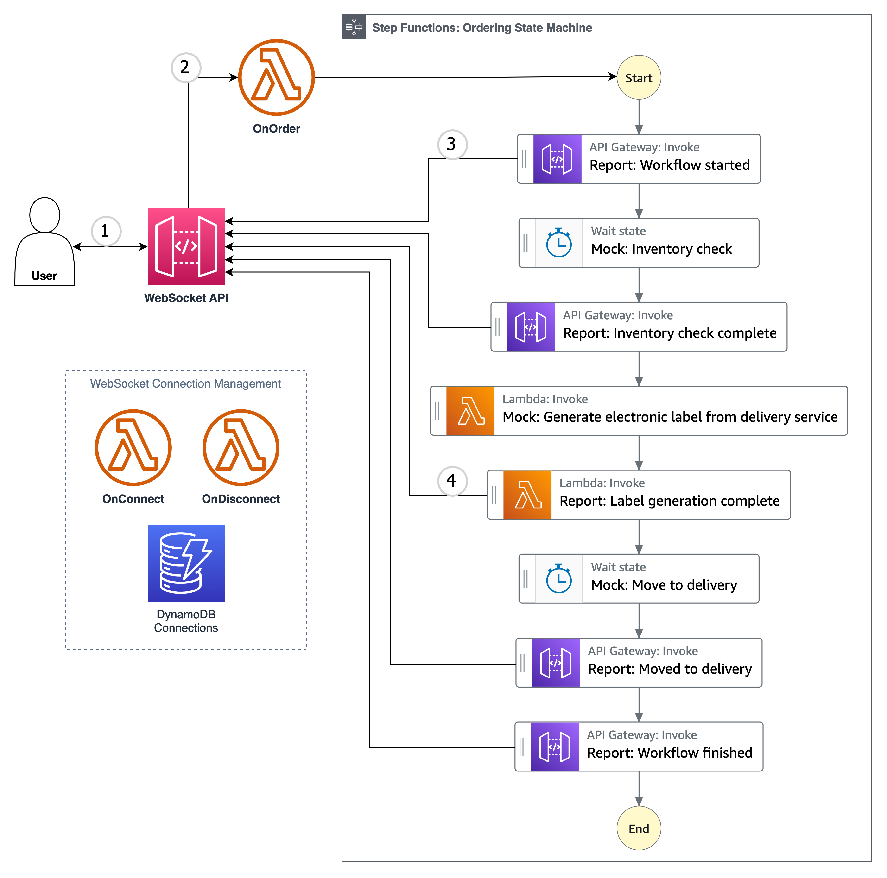
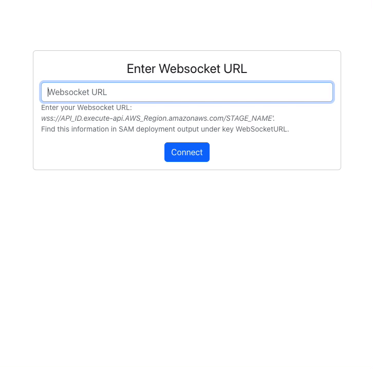

# AWS Step Functions Progress Tracking

This project creates an AWS Step Functions, which mocks a mutli-step ordering process, and demonstrates how clients can monitor the progress via Amazon API Gateway Websocket.



## Project structure

This project contains Backend, which you can deploy with AWS SAM `template.yml`, located in the root of the repository. `handlers` directory contains all AWS Lambda functions' source code. `progress-tracker-frontend` directory contains React-based Frontend, which is optional for deployment.

## Requirements

* [Create AWS Account](https://portal.aws.amazon.com/gp/aws/developer/registration/index.html) in case you do not have it yet or log in to an existing one
* An IAM user or a Role with sufficient permissions to deploy and manage AWS resources
* [AWS CLI](https://docs.aws.amazon.com/cli/latest/userguide/install-cliv2.html) installed and configured
* [Git Installed](https://git-scm.com/book/en/v2/Getting-Started-Installing-Git)
* [AWS Serverless Application Model](https://docs.aws.amazon.com/serverless-application-model/latest/developerguide/serverless-sam-cli-install.html) (AWS SAM) installed
* [Python](https://www.python.org/downloads/) for changing AWS Lambda functions' code
* [NPM](https://www.npmjs.com/get-npm) for changing the frontend code (React)


## Deployment instructions

The project contains Backend and Frontend. You can deploy Backend only. The deployment of Frontend is optional. You can use a hosted Frontend for testing application [here](https://main.d3l6f007ftpjty.amplifyapp.com/) and refer to the code in `progress-tracker-frontend` to understand how it works under the hood. Alternatively, you can deploy the React-based Frontend locally or to AWS.

### Backend

1. Open a terminal and create a new directory, which you will use to clone the repository from GitHub.
1. Clone GitHub repository:
    ``` bash
    git clone https://github.com/aws-samples/aws-step-functions-progress-tracking.git
    ```
1. Change directory to the cloned repository:
    ``` bash
    cd aws-step-functions-progress-tracking
    ```
1. Make sure that your terminal can access AWS resources. Use AWS SAM to deploy the backend resources:
    ``` bash
    sam build && sam deploy --guided
    ```
1. When prompted:
    * Specify a stack name
    * Choose AWS Region
    * Allow SAM CLI to create IAM roles with the required permissions.

   Once you have finished the setup, SAM CLI will save the specified settings in configuration file samconfig.toml so you can use `sam deploy` for quicker deployments.
1. Note the WebSocketURL value in the output of `sam deploy --guided` command. You will need this value for the Frontend later.

### Frontend

#### Option 1: Use hosted Frontend

AWS provides you with hosted React-based Frontend. Simply open [this link](https://main.d3l6f007ftpjty.amplifyapp.com/).

#### Option 2: Deploy frontend Frontend locally

To test Frontend on your local machine, you can deploy the React app locally. To do this, follow these steps:

1. Make sure you have npm installed:
    ``` bash
    npm -v
    ```
1. Navigate to `progress-tracker-frontend` directory:
    ``` bash
    cd progress-tracker-frontend
    ```
1. Start the Frontend:
    ``` bash
    npm start
    ```
   The command will open React app in your default browser. If it does not happen automatically, navigate to http://localhost:3000/ manually.


## How it works



1. The Frontend asks you for Websocket endpoint URL. This is the value of WebSocketURL, that you've got from SAM template.yml deployment. Paste it into `Enter Websocket URL` field and click `Connect` button.
   The Frontend will connect to your previously deployed Backend. You can open developer tools in the browser and navigate to Networking tab, filter by `WS` (Websocket). You should see `Prod` Websocket connection open.
1. Click `Send Order` button to invoke the state machine in AWS Step Functions. You will see messages appear below the `Send Order` button coming from different stages of the state machine. Alternatively, you can observe raw messages in developer tools Networking tab of your browser. The messages will appear under `Prod` Websocket.
1. You can also trigger the state machine execution and observe progress messages by using other Websocket clients, like [Pie Socket](https://www.piesocket.com/websocket-tester). Simply enter your Websocket URL from WebSocketURL value and click connect. To start execution, specify the following message: `{ "action": "onOrder" }` and click `Send` button. The raw progress messages will appear below.
1. Additionally, you can navigate to developer tools in your browser, open `Network` tab and observe raw messages coming to the client.


## Security

See [CONTRIBUTING](CONTRIBUTING.md#security-issue-notifications) for more information.

## License

This library is licensed under the MIT-0 License. See the LICENSE file.

